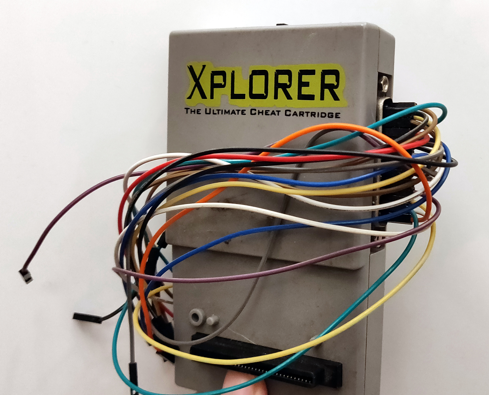

See LICENSE for GNU terms and conditions.

# Arduino-R3-LPT-Parallel-Emulator-For-Xplorer-
Use an Arduino R3 as an extremely slow parallel port emu (For Xplorer/Xploder/Caetla). Xtremely slow, lol.

Sample code to upload to Playstation 1 RAM and start executing via Xplorer/Caetla Parallel IO Carts.
Should be compatible with the PAR standard in theory, though I don't have the hardware to reverse engineer the command sequences.

Note: Later versions of Caetla can be installed on the larger XPlorer FX carts, in which case you should use the Caetla protocol.
The CatFlap source has some pretty good examples of this.

Lastly, for a bit of a laugh...
If you're averse to soldering, you'll be as surprised as I was to find that 2.54 pitch female breadboard jumpers can fit nicely into the DB25 on the side.

